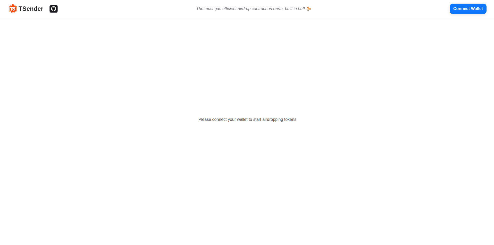
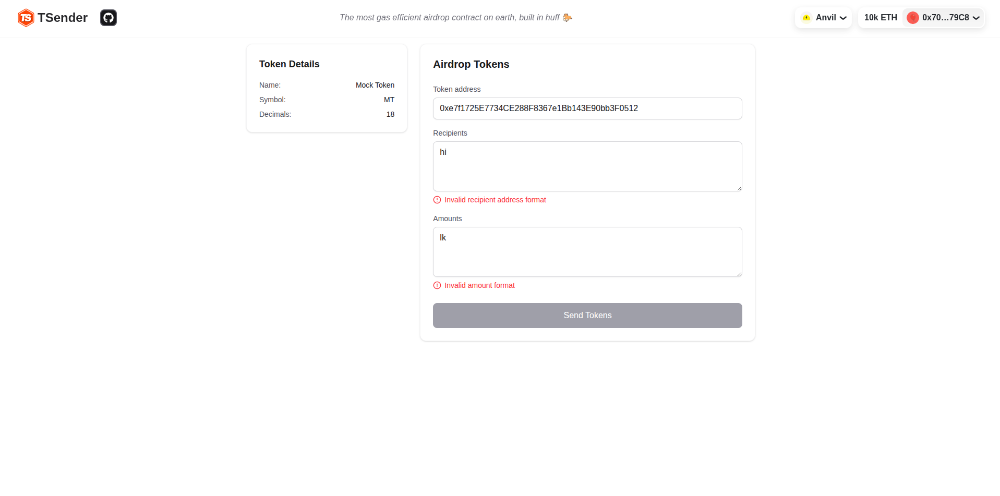
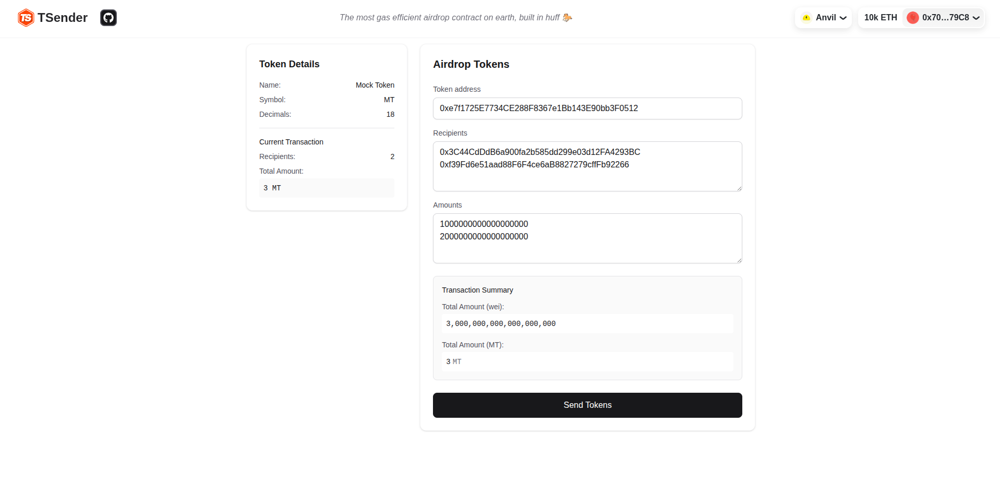

# TSender Airdrop dApp

A simple and powerful dApp for distributing ERC20 tokens to multiple recipients using the `airdropERC20` function from a deployed [**TSender**](https://github.com/cyfrin/TSender) smart contract. Built with **Next.js**, **Viem**, **Wagmi**, and **RainbowKit**, and deployed on IPFS via **Fleek**.

[**TSender UI**](https://great-addition-tinkling.on-fleek.app/)

## 📋 Table of Contents

- [Features](#-features)
- [Tech Stack](#-tech-stack)
- [Getting Started](#-getting-started)
  - [Prerequisites](#prerequisites)
  - [Installation](#installation)
  - [Environment Setup](#environment-setup)
- [Project Structure](#-project-structure)
- [Development](#-development)
- [Build & Deploy](#-build--deploy)
  - [Build Process](#build-process)
  - [Deployment](#deployment)
- [How It Works](#-how-it-works)
  - [Wallet Connection](#1-wallet-connection)
  - [Airdrop ERC20 Interaction](#2-airdrop-erc20-interaction)
  - [Smart Contract Requirements](#3-smart-contract-requirements)
- [Demo](#-demo)
- [License](#-license)

## 🚀 Features

* ✅ Connect with Ethereum wallets using RainbowKit
* ✅ Interact with deployed TSender contract via Viem & Wagmi
* ✅ Input ERC20 token address, recipient addresses, and token amounts
* ✅ Send airdrop transactions in batch
* ✅ Deployed to IPFS using Fleek

## 🛠️ Tech Stack

* [Next.js](https://nextjs.org/) - React framework for production
* [TypeScript](https://www.typescriptlang.org/) - Type-safe JavaScript
* [Wagmi](https://wagmi.sh/) - React Hooks for Ethereum
* [Viem](https://viem.sh/) - TypeScript interface for Ethereum
* [RainbowKit](https://www.rainbowkit.com/) - Wallet connection UI
* [Fleek](https://fleek.xyz/) - IPFS deployment platform

## 🚦 Getting Started

### Prerequisites

- Node.js (v16 or higher)
- pnpm package manager
- A WalletConnect Project ID

### Installation

1. Clone the repository:
```bash
git clone https://github.com/your-username/tsender-airdrop-dapp.git
cd tsender-airdrop-dapp
```

2. Install dependencies:
```bash
pnpm install
```

3. Install required packages:
```bash
pnpm add @rainbow-me/rainbowkit@latest react-icons
```

### Environment Setup

Create a `.env.local` file in the root directory and add your [WalletConnect Project ID](https://cloud.walletconnect.com):

```env
NEXT_PUBLIC_WALLETCONNECT_PROJECT_ID=your_project_id
```

## 🧱 Project Structure

```
/app                 # Next.js App Router
/src
  └─ rainbowKitConfig.tsx   # wagmi + RainbowKit config
  └─ providers.tsx          # Web3 context providers
/public              # Static assets
```

## 🔧 Development

Start the development server:

```bash
pnpm dev
```

Visit [http://localhost:3000](http://localhost:3000) to use the app locally.

## 🚀 Build & Deploy

### Build Process

1. Build the application:
```bash
pnpm run build
```

Expected output:
```
✓ Compiled successfully in 30.0s
✓ Linting and checking validity of types    
✓ Collecting page data    
✓ Generating static pages (5/5)
✓ Collecting build traces    
✓ Exporting (3/3)
✓ Finalizing page optimization 
```

Build statistics:
- Main page size: 8.1 kB
- First Load JS: 167 kB
- Shared chunks: 103 kB

### Deployment

1. Deploy to IPFS using Fleek:
```bash
fleek sites deploy
```

2. After successful deployment, you'll receive:
- IPFS Content Identifier (CID)
- Gateway URL for accessing your dApp

Example output:
```
✅ Success! Deployed!
> Site IPFS Content Identifier (CID): bafybeigfwy5nvr3gkns3for7xrijo3upigze3jz3ply2nz3j3zr7ytwnla
💡 You can access it through the gateway:
🔗 https://great-addition-tinkling.on-fleek.app
```

Note: You may see a warning about `pino-pretty` during build, but this doesn't affect the functionality of the application.

## 🧪 How It Works

### 1. Wallet Connection

* RainbowKit provides a seamless multi-wallet user experience
* The app is wrapped in `<WagmiProvider>` and `<RainbowKitProvider>` for Web3 functionality

### 2. Airdrop ERC20 Interaction

Users can input:
* ERC20 Token address
* List of recipient addresses
* List of token amounts

The app uses Viem to construct and send transactions to the `airdropERC20()` function on the deployed TSender contract.

### 3. Smart Contract Requirements

The smart contract must implement the following function:

```solidity
function airdropERC20(
    address token,
    address[] calldata recipients,
    uint256[] calldata amounts
) external;
```

## 📸 Demo







## 📝 License

This project is licensed under the MIT License - see the [LICENSE](LICENSE) file for details.

